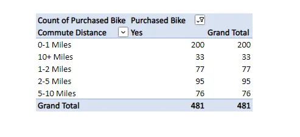

# Bike Sales Analysis using Excel
This project aims to conduct a comprehensive analysis on the bike sales data collected from a Bike store. The analysis is done mainly to identify which factors contribute mainly to the purchase of bikes.
## Objectives
### Data Cleaning
Cleaning the dataset to address any duplicates, missing and inconsistent data
### Data Preparation 
Making the Dataset Consistent for columns with inconsistent data. In addition to making the result more reliable we check for any outliers and aggreate some column values to include range values instead of individual values
### Creating Pivot Tables and Charts
Creating Pivot Tables in order to analyse each attributes individually to the overall result.
### Creation of Dynamic Dashboards
Finally to bring it all together we collect all charts created from the pivot tables.Creating a slicer during this stage helps us identify the effect of an attribute to the various charts that is depicted.
## Dataset
### Id
A unique Identifier for each customer
### Martial Status
Attribute used to Identifying whether our customer is married or not
### Gender 
Attribute used to Identifying gender status
### Income
Attribute used to Identify income of the customer
### Children
Attribute used to identify amount of children a customer has
### Education
Attribute used to identify education status of customer
### Occupation
Attribute used to identify what job title the customer is holding
### Home Owner

Attribute used to identify whether or not customer owns a home 
### Cars
Attribute used to check amount of cars the customer has
### Commute 
Attribute used to check the distance between the home and place of work of the customer
### Region
Attribute used to check the area/region where the customer is located
### Age
Attritube used to determine age of customer
### Purchased Bike
Attribute used to determine whether or not a customer has purchased a bike
## Tools
We’ll be using excel in order to explore our data and prepare the different pivot tables and charts we are going to use for the project.

## Approach
### Data Import and Initial Exploration
In data analysis, the initial step of importing a dataset and exploring its initial content is akin to opening a door to valuable insights.Down below is the table we’ll be analyzing

### Identifying and Removing Duplicate Data
Now, we want to see if there are any duplicates in our data, which is mostly undesirable. To check duplicates- Select the table> go to data> select remove duplicates> select all columns> press ok. Our data had 26 duplicate values for some reason. 
### Identifying and Handling Missing Data
Here, we’re examining our dataset for missing values. Luckily our dataset doesn’t contain any null values.
### Data Preparation and Column Transformation
In this step, we are preparing the dataset for analysis. We remove unnecessary columns and rename some columns to improve clarity and consistency.In this step, we are preparing the dataset for analysis. We remove unnecessary columns and rename some columns to improve clarity and consistency.This can be done simply by going to Home>Find and Select> Find and Replace.
### Check for any outliers
In order to have a more predictable and more insightful result we will check if there are any outliers.We will use charts to see what’s happening with the data since they give an easy to understand picture of our data. For this analysis let’s use a boxplot for the Income column.

.

As can be seen, there isn't much to worry about. Everything just seems fine.
## Trend Analysis
### Checking if there is any age group that dominates in the data.
Let’s analyze the age column to check which age group dominates in the data. We are using a histogram to see the trend, which looks like this:

As can be seen, there are more people in the age group 30–50, but it doesn't give much clear picture so We will have to add a column “age category” beside the age column so that every age falls into an age group using the following formula: =IF(L3>55,”Old”,IF(L3>31,”Middle Age”,IF(L3<=31,”Adolescent”,”Invalid”)))

Now, the data seems good to go.

### Preparing the needed tables and charts
Now, let’s create some pivot tables to see what factors influence the sales of the bikes.

1. #### Avg Income of Females and Males who purchased and did not purchase bikes:
   

The chart explains it better

1. #### Bike purchased per age group:
The following Line Chart speaks for itself

1. #### Commute Distance vs Bike purchased:
   

1. Preparing a Dynamic Dashboards

The crux of a data analysis project is to create visually appealing, easy to understand, dynamic and interactive dashboards.

To make dashboards more interactive and dynamic we will add slicers to filter results as per our needs.

We can add slicer from whoever column we wish, for the sake of this project I have included three, on Region, Cars and Occupation.

The final dashboard looks like this:

